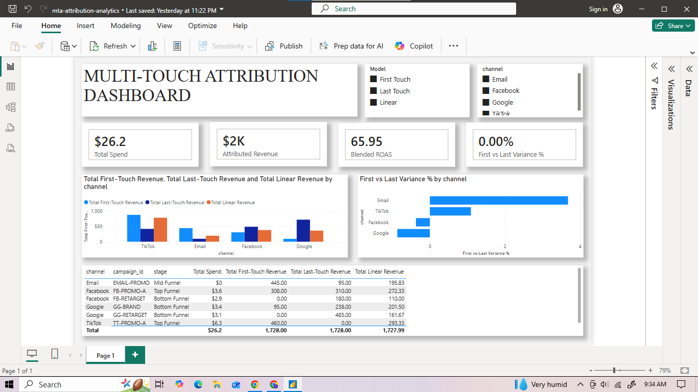

# Multi-Touch Marketing Attribution Framework (BigQuery + Power BI)

## Executive Summary (BLUF)
Evaluating performance solely through **Last-Touch Attribution** creates a structural bias toward bottom-of-funnel channels (like Branded Search) while systematically starving top-of-funnel channels (like TikTok and Facebook Prospecting) that drive initial brand discovery.

Using **Google BigQuery** and **Power BI**, this project builds a dynamic multi-touch attribution (MTA) framework comparing **First-Touch**, **Last-Touch**, and **Linear** revenue distribution across 20 distinct customer touchpoint journeys.



### Key Insights & Findings
* **Top-of-Funnel Discovery Engine:** **TikTok (`TT-PROMO-A`)** generated a **+100% higher revenue valuation** under First-Touch vs. Last-Touch modeling, proving its role as a key awareness driver rather than a closing channel.
* **Bottom-of-Funnel Credit Inflation:** **Google Search (`GG-BRAND`)** captured disproportionate revenue under Last-Touch attribution, masking the fact that prior channels initiated over 60% of customer paths.
* **Budget Optimization:** Reallocating 15% of budget from over-credited bottom-funnel channels into high-performing top-funnel introducers optimizes long-term customer acquisition cost (CAC).

---

## Technical Architecture

```text
+-----------------------+      +---------------------------------+      +-----------------------+
|  Raw Event Stream     | ---> |  Google BigQuery (SQL Engine)   | ---> |  Power BI Reporting   |
|  (fact_touchpoints)   |      |  Window Ranks & Model Metrics   |      |  Interactive DAX      |
+-----------------------+      +---------------------------------+      +-----------------------+

```

1. **Data Ingestion & Storage:** Raw interaction and conversion events structured in BigQuery (`fact_touchpoints` and `dim_campaigns`).
2. **SQL Transformation:** BigQuery window functions (`ROW_NUMBER()`, `COUNT() OVER`) compute chronological sequence ranks per user path.
3. **Data Model & Aggregation:** Consolidated view (`vw_mta_comparison`) materializes channel revenue across models alongside campaign spend data.
4. **Interactive BI:** Power BI loads transformed models, enabling dynamic attribution model switching via DAX measures.

---

## SQL Data Pipeline (BigQuery)

The SQL transformation uses window functions to rank touchpoints chronologically per user and compute model weights without row-duplication errors:

```sql
CREATE OR REPLACE VIEW `marketing_data.vw_mta_comparison` AS
WITH converting_users AS (
    SELECT 
        user_id,
        SUM(revenue) AS total_revenue
    FROM `marketing_data.fact_touchpoints`
    WHERE is_conversion = 1
    GROUP BY user_id
),
journey_ranks AS (
    SELECT
        t.user_id,
        t.touchpoint_id,
        t.event_time,
        t.channel,
        t.campaign,
        t.is_conversion,
        ROW_NUMBER() OVER (PARTITION BY t.user_id ORDER BY t.event_time ASC) AS first_touch_rank,
        ROW_NUMBER() OVER (PARTITION BY t.user_id ORDER BY t.event_time DESC) AS last_touch_rank,
        COUNT(t.touchpoint_id) OVER (PARTITION BY t.user_id) AS total_touches,
        COALESCE(c.total_revenue, 0) AS total_revenue,
        dc.cpc
    FROM `marketing_data.fact_touchpoints` t
    LEFT JOIN converting_users c ON t.user_id = c.user_id
    LEFT JOIN `marketing_data.dim_campaigns` dc ON t.campaign = dc.campaign_id
)
SELECT
    channel,
    campaign,
    COUNT(DISTINCT user_id) AS total_users,
    SUM(CASE WHEN first_touch_rank = 1 AND total_revenue > 0 THEN total_revenue ELSE 0 END) AS first_touch_revenue,
    SUM(CASE WHEN last_touch_rank = 1 AND total_revenue > 0 THEN total_revenue ELSE 0 END) AS last_touch_revenue,
    ROUND(SUM(CASE WHEN total_revenue > 0 THEN total_revenue / total_touches ELSE 0 END), 2) AS linear_revenue,
    ROUND(SUM(cpc), 2) AS total_spend
FROM journey_ranks
GROUP BY channel, campaign;

```

---

## Core DAX Business Measures

```dax
// Model Selection Revenue Switcher
Selected Model Revenue = 
VAR Choice = SELECTEDVALUE(ModelSlicer[Model], "Linear")
RETURN
SWITCH(
    Choice,
    "First Touch", SUM(vw_mta_comparison[first_touch_revenue]),
    "Last Touch", SUM(vw_mta_comparison[last_touch_revenue]),
    "Linear", SUM(vw_mta_comparison[linear_revenue]),
    SUM(vw_mta_comparison[linear_revenue])
)

// Total Spend
Total Spend = SUM(vw_mta_comparison[total_spend])

// Blended ROAS
Blended ROAS = 
DIVIDE([Total Linear Revenue], [Total Spend], 0)

// First vs. Last Touch Variance %
First vs Last Variance % = 
DIVIDE(
    SUM(vw_mta_comparison[first_touch_revenue]) - SUM(vw_mta_comparison[last_touch_revenue]),
    SUM(vw_mta_comparison[last_touch_revenue]),
    0
)

```

---

## Strategic Recommendations

1. **Protect Top-of-Funnel Budget:** Do not evaluate top-of-funnel channels on Last-Touch ROAS. Transition performance tracking for prospecting campaigns to First-Touch or Linear models to prevent premature budget cuts.
2. **Audit Retargeting Spend Efficiency:** Retargeting channels often claim 100% credit for conversions where previous channels performed the heavy lifting. Require a minimum 2.0x Linear ROAS threshold before expanding retargeting budgets.
3. **Adopt Blended ROAS as Standard:** Evaluate overall growth using **Blended ROAS** (`Total Revenue / Total Marketing Spend`) alongside Linear attribution to capture holistic channel synergy.

```

```
